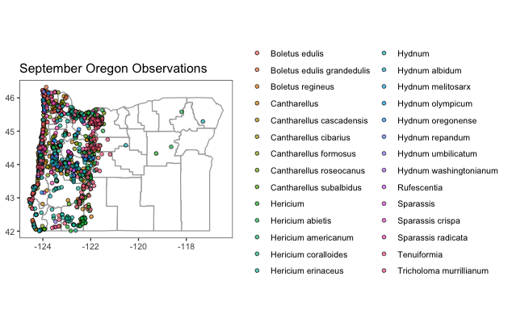

# Using R for powerful iNaturalist data wrangling
Hello there, my name is Michele Wiseman and I'm a PhD candidate in Botany and Plant Pathology at Oregon State University. Aside from being a PhD student, I'm also a serious mycophile (lover of fungi).  When I first discovered my passion for fungi (ca. 2005), I dove into whatever resources I could find to learn more about them and how I could find them including reading online forums (e.g. [Shroomery](www.shroomery.com)), mycological books (like [Mushrooms Demystified](https://www.goodreads.com/en/book/show/415949.Mushrooms_Demystified), studying observations on [MushroomObserver](www.mushroomobserver.org), and even looking at specimens in my local mycological herbarium, the [Oregon State Collection](https://bpp.oregonstate.edu/herbarium/). *I quickly learned that the most efficient way to find fungi was by mapping out where observations occur using lat/long coordinates.* Alas, I started noting the township information and coordinates on MushroomObserver observations and herbarium packets and would use (**gasp**) USGS maps to discover phylogeographic trends. 

Fast forward to today: after 17 years of hunting and studying fungi, I know a smidge more about fungal ecology and biology; however, I still routinely map out observational data for both professional endeavors (e.g. biodiversity studies) and for personal endeavors (to up my mushroom hunting game). I can now accomplish what used to take weeks of data collection and curation in a matter of minutes using modern data wrangling and visualization tools. 

Today, I'd like to teach you about the power of these tools so you too can up your mushroom hunting game (*and will hopefully realize the importance of citizen-scientist observations*).

## Table of Contents

* [Introduction to iNaturalist](#introduction-to-inaturalist)
* [Introduction to R](#introduction-to-r)
  * [User-friendly R coding with Rstudio](#User-friendly-R-coding-with-Rstudio)
  * [Comprehensive-R-Archive-Network-(CRAN)](#Comprehensive-R-Archive-Network-(CRAN))
  * [Loading and Installing Packages](#loading-and-installing-packages)
* [Code and Instructions for Mapping iNaturalist Data in R](#mapping-inat-in-r)
* [Mapping along a trail](#Mapping-iNaturalist-observations-along-a-trail)
* [Code for Counting and Visualizing Papers Discussing iNaturalist](#inat-keyword)
* [Resources](#resources)
* [Other](#other)
* [Contact](#contact)
* [Acknowledgements](#acknowledgements)

---

## Introduction to iNaturalist
[Back to top](#table-of-contents)

[iNaturalist](https://www.inaturalist.org/)  is a social network of naturalists, citizen scientists, and biologists built on the concept of mapping and sharing observations of biodiversity across the globe. In 2017, iNaturalist usage exploded due to the release of a computer vision tool that automatically suggests species IDs from uploaded pictures. As computer-vision aided identification lowered the barrier to entry, more and more citizen scientists started using the tool. Consequently, the use of iNaturalist data in conservation, biodiversity, hybridization, phylogeography, etc., research also exploded. 


Using iNaturalist is easy - simply capture the nature world, record any pertinent notes (e.g. location if your camera/phone doesn't capture lat/long coordinates), and upload to [iNaturalist](https://www.inaturalist.org/).  

**Using iNaturalist on your Phone**

First, download the iNaturalist application to your iPhone or Android phone. Then, follow the instructions below (provided by [iNaturalist](https://www.inaturalist.org/pages/getting+started)).

|  |
|-|

**Using iNaturalist on the web**

Simply navigate to [iNaturalist](https://www.inaturalist.org/), sign up for an account, and then you're ready to make observations. 

|  |
|-|

**For a more detailed tutorial, check out [getting started in iNaturalist](https://www.inaturalist.org/pages/getting+started).**

---

## Introduction to R 
[Back to top](#table-of-contents)

*Note: This first section's text is quoted directly from **An Introduction to R** written by Bill Venables and David M. Smith. [Download the pdf](https://cran.r-project.org/doc/manuals/r-release/R-intro.pdf) for a more comprehensive introduction to R.*

**[R](https://www.r-project.org/)** is an integrated suite of software facilities for **data manipulation, calculation and graphical display**. Among other things it has:

* an effective data handling and storage facility,
* a suite of operators for calculations on arrays, in particular matrices,
* a large, coherent, integrated collection of intermediate tools for data analysis,
* graphical facilities for data analysis and display either directly at the computer or on hardcopy, and
* a well developed, simple and effective programming language (called ‘S’) which includes conditionals, loops, user defined recursive functions and input and output facilities. (Indeed most of the system supplied functions are themselves written in the S language.)

The term “environment” is intended to characterize it as a fully planned and coherent system, rather than an incremental accretion of very specific and inflexible tools, as is frequently the case with other data analysis software. R is very much a vehicle for newly developing methods of interactive data analysis. It has developed rapidly, and has been extended by a large collection of packages. However, most
programs written in R are essentially ephemeral, written for a single piece of data analysis.

---

### User-friendly R coding with Rstudio
[Back to top](#table-of-contents)

**[RStudio](https://www.rstudio.com/products/rstudio/)** is an integrated development environment (IDE) for R. It includes a **console, syntax-highlighting editor** that supports direct code execution, as well as **tools for plotting, history, debugging and workspace management**. 

**For most of my R coding, I use Rstudio and I recommend you do the same due to its ease-of-use**. 

There's a nice list of Rstudio tutorials [here](https://education.rstudio.com/learn/beginner/).

---

### Comprehensive R Archive Network (CRAN)
[Back to top](#table-of-contents)

R is an open source tool which offers great flexibility in customization of code, but can also present issues with package compatibility (e.g. conflicting code in between libraries) and poor package management (i.e. things get outdated and abandoned). You can always check the status of a package by looking at it's Comprehensive R Archive Network (CRAN) repository information. The CRAN page for a package will tell you when it was last updated, any necessary dependencies for the package, will link you to the reference manual, and will link you to a page where you can submit bug fix requests. **Most packages are on [CRAN](https://cran.r-project.org/) or are directly hosted on [GitHub](https://github.com/).**

The [CRAN](https://cran.r-project.org/) pages are linked below for today's required packages:

* [ggmaps](https://cran.r-project.org/web/packages/ggmaps/index.html)
* [janitor](https://cran.r-project.org/web/packages/janitor/index.html)
* [lubridate](https://cran.r-project.org/web/packages/lubridate/index.html)
* [maps](https://cran.r-project.org/web/packages/maps/index.html)
* [rinat](https://cran.r-project.org/web/packages/rinat/index.html)
* [tidyverse](https://cran.r-project.org/web/packages/tidyverse/index.html)

There are also developmental versions which often contain coding examples on [GitHub](https://github.com/):

* [ggmap](https://github.com/dkahle/ggmap)
* [janitor](https://github.com/sfirke/janitor)
* [lubridate](https://github.com/tidyverse/lubridate)
* [maps](https://github.com/nextcloud/maps)
* [rinat](https://github.com/ropensci/rinat)
* [tidyverse](https://github.com/tidyverse/tidyverse)

---

### Loading required packages
[Back to top](#table-of-contents)

To best utilize the power of R, you must install and load the accessory packages. To install packages, run the command `install.packages("[libraryname]")`. For example, to install `tidyverse` I would run `install.packages("tidyverse")`. If you need to install many packages at once, you can make a one line command that creates a [vector](https://www.tutorialspoint.com/r/r_vectors.htm) of the packages you want and run the installs them. For example, to install the packages we need: `install.packages(c("tidyverse", "rinat", "lubridate","maps", "janitor", "ggmap"))`

As the packages install, you may be prompted to also install dependencies. Say yes to any dependencies.

Once your packages have installed, load them using the command `library([packagename])`. As above, you can combine them all in one line of code if you wish, though I prefer to keep them separated for ease of customization.

---

## Using R for powerful iNaturalist data analyses
[Back to top](#table-of-contents)

**Lets map some fungi.**
 
First, load and install required packages.

```r, setup
# if you need to install any packages, remove the hashtag (i.e. uncomment) and then run. 
# install.packages(c("tidyverse", "rinat", "lubridate","maps", "janitor", "ggmap"))

# the required packages
library(tidyverse)         # cleaning data
library(rinat)             # importing iNaturalist data
library(lubridate)         # changing data format easily
library(maps)              # database of maps
library(janitor)           # helpful data tidying tools
library(ggmap)             # powerful mapping tool

### optional - for aesthetics ###
#library(ggthemes)      # expanded themes, optional
```

You can either make a nice list for exporting into GIS, Tableau etc. ...

To figure out a taxons ID, look at the iNaturalist URL. For example, for Inocybe calamistratum, the taxon ID would be 1112482 because the URL is `https://www.inaturalist.org/taxa/1112482-Inosperma-calamistratum`.

You can similarly figure out locations by searching the location in iNat and checking the url. E.g. Oregon is 10 because the `place_id` = 10 (https://www.inaturalist.org/observations?place_id=10&subview=map). 

So, lets check out my favorite mushrooms in Oregon during October with this little for loop function. I'll define the taxa I'm interested in 'tids' (short for taxon ids). For this search, I'll looking for Cantharellus spp. (47348), Boletus edulis (48701), Boletus regineus (415504), Sparassis spp. (63020), Hydnum spp. (48422), Hericium spp. (49160), and Tricholoma murrillianum (521711). Feel free to substitute the taxa (under `tids`) or the place under `place_id`. 

```r, inat csv
# A function to call `get_inat_obs` iteratively for each taxon_id present in a vector
batch_get_inat_obs <- function(
  taxon_ids_vector,             # No Default, so required, a vector of taxids
  place_id = 10, 
  geo = TRUE,                   # Default to TRUE
  maxresults = 1000,            # Default to 1000 results max
  #month = 10,                  # Uncomment to specify month
  meta = FALSE                  # Default to FALSE
) {
  
  # The dataframe (empty now) which we will return at the end, once it's full of results
  return_df = data.frame()
  
  # Iterate over the taxon ids in `taxon_ids_vector`, querying each again inaturalist 
  for (tid in taxon_ids_vector) {
    
    #Report status to console
    print(paste("Querying the following taxon id now:", tid))
    
    #Query inat here, using this taxon_id (`tid`, this iteration), and the other argument values
    #from the function declaration
    this_query = get_inat_obs(taxon_id = tid, 
                              place_id = place_id,
                              geo = geo,
                              maxresults = maxresults,
                              meta = meta)
    
    #Add the result of `get_inat_obs` on this iteration to a growing dataframe
    return_df = rbind(return_df, this_query)

  }
  #After the loop is done, return the full dataframe
  return(return_df)
}

# The vector of taxon_ids
tids = c(47348, 48701, 415504, 63020, 48422, 49160, 521711)

# Call the function and assign the result to `oregon_edibles`
oregon_edibles = batch_get_inat_obs(tids)

# Tidying data
oregon_edible_accurate <- oregon_edibles %>%
  filter(positional_accuracy < 5000, na.rm = TRUE)  %>%               #needs to be accurate within 5km
  #filter(coordinates_obscured == "false") %>%                         #cant be obscured
  filter(captive_cultivated == "false")   %>%                         #no cultivated specimens
  separate(datetime, sep="-", into = c("year", "month", "day"))       #will be useful for Tableau

# Renaming months
oregon_edible_accurate$month[oregon_edible_accurate$month=="01"] <- "January"
oregon_edible_accurate$month[oregon_edible_accurate$month=="02"] <- "February"
oregon_edible_accurate$month[oregon_edible_accurate$month=="03"] <- "March"
oregon_edible_accurate$month[oregon_edible_accurate$month=="04"] <- "April"
oregon_edible_accurate$month[oregon_edible_accurate$month=="05"] <- "May"
oregon_edible_accurate$month[oregon_edible_accurate$month=="06"] <- "June"
oregon_edible_accurate$month[oregon_edible_accurate$month=="07"] <- "July"
oregon_edible_accurate$month[oregon_edible_accurate$month=="08"] <- "August"
oregon_edible_accurate$month[oregon_edible_accurate$month=="09"] <- "September"
oregon_edible_accurate$month[oregon_edible_accurate$month=="10"] <- "October"
oregon_edible_accurate$month[oregon_edible_accurate$month=="11"] <- "November"
oregon_edible_accurate$month[oregon_edible_accurate$month=="12"] <- "December"


write.csv(oregon_edibles, "edibles.csv")

```

Or you can use the data to map directly in R

```r, 
ggplot(data = county_info) +             
  geom_polygon(aes(x = long,              #base map
                   y = lat,
                   group = group),
               fill = "white",            #background color
               color = "darkgray") +      #border color
  coord_quickmap() +
  geom_point(data = oregon_edible_accurate,               #these are the research grade observation points
             mapping = aes(
               x = longitude,
               y = latitude,
               fill = scientific_name),                    #changes color of point based on scientific name
             color = "black",                              #outline of point
             shape= 21,                                    #this is a circle that can be filled
             alpha= 0.7) +                                 #alpha sets transparency (0-1) 
  ggtitle(label = "October Oregon Observations")+
theme_bw() +                                               #just a baseline theme
  theme(
    plot.background= element_blank(),                      #removes plot background
    panel.background = element_rect(fill = "white"),       #sets panel background to white
    panel.grid.major = element_blank(),                    #removes x/y major gridlines
    panel.grid.minor = element_blank(),
    legend.title = element_blank(),
    #legend.position = "none",
    axis.title.x = element_blank(),
    axis.title.y = element_blank()) 

```


---

## Mapping iNaturalist observations along a trail
[Back to top](#table-of-contents)

Leading a hike and need a species list? You can manually use a bounding box to limit species to your trail using the iNaturalist web platform, but it's clunky and not precise. A really cool alternative is to make use of the [iNat trails](https://github.com/joergmlpts/iNat-trails) python script which maps out all observations along a trail. 

To start, download the [iNat trails](https://github.com/joergmlpts/iNat-trails) repository from github (instructions on downloading from github [here](https://docs.github.com/en/repositories/creating-and-managing-repositories/cloning-a-repository)). If you have git installed, this can be simply `git clone https://github.com/joergmlpts/iNat-trails`. 

In order to run `iNat-trails`, you must also install a few dependencies. Assuming you have Python 3.7 or later, you can do this in command line by typing:
```sh
sudo apt install --yes python3-pip python3-aiohttp python3-shapely
pip3 install folium
```
Once you've got all the dependencies installed, give one of the examples a test run by typing:
```sh
./inat_trails.py examples/Rancho_Canada_del_Oro.gpx
```
You're output should look like this: 

```
Reading 'examples/Rancho_Canada_del_Oro.gpx'...
Loaded 13 named roads and trails: Bald Peaks Trail, Canada Del Oro Cut-Off Trail, Canada Del Oro Trail, Casa Loma Road,
    Catamount Trail, Chisnantuk Peak Trail, Little Llagas Creek Trail, Llagas Creek Loop Trail, Longwall Canyon Trail,
    Mayfair Ranch Trail, Needlegrass Trail, Serpentine Loop Trail.
Loaded 2,708 iNaturalist observations of quality-grade 'research' within bounding box.
Excluded 1,694 observations not along route and 13 with low accuracy.
Loaded 829 taxa.
Waypoints written to './Rancho_Canada_del_Oro_Open_Space_Preserve_all_research_waypoints.gpx'.
Table written to './Rancho_Canada_del_Oro_Open_Space_Preserve_all_research_observations.html'.
Map written to './Rancho_Canada_del_Oro_Open_Space_Preserve_all_research_mapped_observations.html'.
```

Assuming things work, lets try a different trail. Pick one that you regularly recreate on. For this example, I'll look at a loop trail at the Lewisburg Saddle here in Corvallis, OR.  Navigate to [Caltopo](https://caltopo.com/) and search your trail (for me: `Lewisburg Saddle`). Next, use the line tool to trace your trail (note: this shouldn't be hard since the path autofits to the trail as you go). Save the trail with a name and export it as a GPX file. 

**Tracing and saving our trail**
|  |
|-|

**Exporting our trail data**
|  |
|-|

Rename your exported file to reflect the trail and move it into the examples directory (e.g. `~/iNat-trails-master/examples/`). Now, lets rerun with our trail!

To search for all taxa, simply run default parameters: 
`./inat_trails.py examples/lewisburgsaddle.gpx`

To search for specific taxa, add a `--iconic_taxon` flag. For example: 
`./inat_trails.py --iconic_taxon Fungi examples/lewisburgsaddle.gpx`

Additional parameters can be found by running `./inat_trails.py -h`

Let's check out the output: 
* Species Table: `./McDonald_State_Forest_all_research_observations.html`
* Map of Species Along the Trail: `./McDonald_State_Forest_all_research_mapped_observations.html`

**The trail species map output file**
|  |
|-|

To examine specific taxa along my trail I can check or uncheck the boxes next to the various taxon groups. While not explicitly stated, the taxonomic names are organized by relation, so the fungal families group together, plants group together, etc. 

**The species list output file**
|  |
|-|

The species map gives a nice hierarchical species list of the species observed along your trail. In addition, each observation has a direct link to the iNaturalist entry, thus enabling further investigation if necessary. 

If you expected more observations along your trail it's probably because the default observation filtering is `research-grade`. Run `./inat_trails.py -h` to explore observation grade options amongst other customizable parameters. 

```
usage: inat_trails.py [-h] [--quality_grade QUALITY_GRADE] [--iconic_taxon ICONIC_TAXON] [--login_names] gpx_file [gpx_file ...]

positional arguments:
  gpx_file              Load GPS track from .gpx file.

optional arguments:
  -h, --help            show this help message and exit
  --quality_grade QUALITY_GRADE
                        Observation quality-grade, values: all, casual, needs_id, research; default research.
  --iconic_taxon ICONIC_TAXON
                        Iconic taxon, values: all, Actinopterygii, Amphibia, Animalia, Arachnida, Aves, Chromista,
                        Fungi, Insecta, Mammalia, Mollusca, Plantae, Protozoa, Reptilia; default all.
  --login_names         Show login name instead of numeric observation id in table of observations.
  --month               Show only observations from this month and the previous and next months.
  ```

---

## Training your own model
[Back to top](#table-of-contents)

iNaturalist has computer vision models for over 55,000 taxa. To ascertain whether your taxa of interest is in that dataset, look out for this tag on your taxon's page:


You can see an example of this on the *[Gomphus clavatus](https://www.inaturalist.org/taxa/54121-Gomphus-clavatus)* (Pig's Ear) taxon page. 

If your taxon does not yet have a computer vision model, you can download iNaturalist photos to make your own. These analyses may have a higher barrier to entry, but don't let the code intimidate you - there's lots of great information out there and it's fairly simple if you take your time. 

**To download photos for specific taxa, check out the following resources:**

* [iNaturalist Open Data](https://github.com/inaturalist/inaturalist-open-data) **Expert level**
* [getiNat Photo Data](https://github.com/rasanderson/BIO8068-getimages/blob/main/get_data.R)

**Resources for training your own model using the photos you've downloaded:**

* [Butterfly Machine Learning](https://github.com/CSellwood1/Deep-learning/blob/master/wildlife_images_CS.docx) - an excellent and thorough iNat machine learning tutorial

*more to come...*

---

## Resources
[Back to top](#table-of-contents)

**Mapping**
* [Caltopo](https://caltopo.com/) - free web-based mapping
* [iNat National Park Observations](https://github.com/NatureServe/inat-nps-download) - for mapping National Park iNat observations

**Data Analysis**
* [pyNaturalist](https://github.com/pyinat/pyinaturalist) - manipulation of iNat data with python
* [iNaturalist API](https://api.inaturalist.org/)
* [iNaturalist API Tutorial](https://forum.inaturalist.org/t/in-pursuit-of-mappiness-part-1/21864)
* [iNaturalist GitHub Page](https://github.com/inaturalist/)

**Other iNaturalist Tutorials**
* [Creating Atlases on iNaturalist](https://www.inaturalist.org/pages/atlases)
* [How to Annotate Observations](https://forum.inaturalist.org/t/using-identify-to-annotate-observations/1417)


---
## Contact?  
[Back to top](#table-of-contents)

Feel free to [email me](mailto:michele.wiseman@oregonstate.edu?subject=Mapping%20iNaturalist%20Observations) with questions, comments, or if you're interested in collaboration. Follow what I'm up to on my [website](https://mswiseman.github.io/), [twitter](https://twitter.com/mswiseman), and/or [iNat](https://www.inaturalist.org/people/mswiseman) page. 

---

## Acknowledgments
[Back to top](#table-of-contents)

I'd like to thank my PhD advisor (and often, general life mentor) **David Gent** who is endlessly supportive of eccentric projects and is incredibly patient, kind, and brilliantly insightful. I feel so lucky to be advised by you. I'd also like to thank my **Jessie Uehling**, **Dan Luoma**, and **Joey Spatafora** for keeping me in the fungal loop inspite of having strayed to the plant side for my dissertation work. Jessie has been especially encouraging of all my mapping pursuits. Thank you to **Ishika Kumbhakar** who is absolutely brilliant with GIS data and mapping and often comes in clutch when I'm troubleshooting difficult analyses. Finally, thank you to my close network of friends and family members who are so patient with my neverending endeavors: my mom (Judi Sanders), twin sister (Nicole Wiseman), brother (Michael Wiseman), and the super amazing mildew mafia (Teddy Borland, Briana Richardson, Steve Massie, Nanci Adair, Carly Cooperider, Nadine Wade, Liz Lopez, Tatum Clark).
